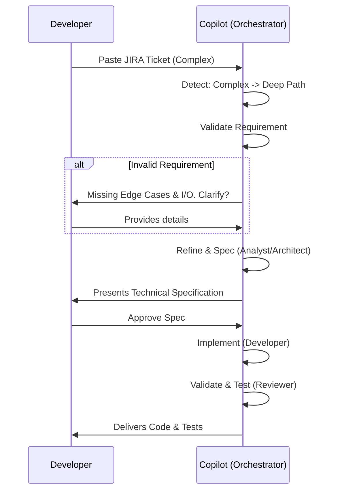
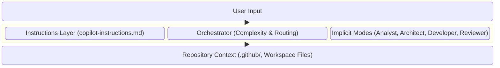

# 📄 AI Engineering Pattern – Copilot Agentic Workflow

## 1. Overview
The Copilot Agentic Workflow is an advanced, instruction-driven system designed to turn GitHub Copilot into an intelligent orchestrator. Instead of relying on developers to write complex, multi-shot prompts, this pattern uses a lightweight central instruction set that automatically detects task complexity, validates requirements (like JIRA tickets), and intelligently routes execution between a rapid "Fast Path" and a rigorous "Deep Path".

This pattern bridges the gap between simple code completion and full autonomous AI engineering by enforcing structured thinking, requirement validation, and implicit persona adoption (Analyst, Architect, Developer, Reviewer) without the user needing to explicitly manage agents.

## 2. Architecture
The architecture consists of three primary conceptual layers:

- **Orchestrator Layer (`copilot-instructions.md`)**: The primary controller that Copilot reads to understand how to behave. It handles intent detection, complexity analysis, and routing.
- **Adaptive Flow Mechanism**: The logic that branches execution. Simple tasks bypass heavy process, while complex tasks are forced through validation, refinement, and specification gates.
- **Implicit Modes**: Persona-based execution states (Analyst, Architect, Developer, Reviewer) that activate automatically based on the workflow stage, applying specific skills (e.g., test generation, code review) without explicit user invocation.

### Recommended Repository Structure
To implement this pattern for GitHub Copilot in VS Code, we recommend organizing your root and `.github` directory as follows:

```text
copilot-instructions.md        # (Primary Controller) Contains the core routing, complexity detection, and mode definitions.
.github/
  ├── agents/                  # Behavioral personas and modes (e.g., analyst.md, architect.md, developer.md, reviewer.md).
  ├── prompts/                 # Context-specific templates (e.g., jira-refinement.md, pr-review.md).
  ├── skills/                  # Technical guidelines and standards (e.g., typescript-standards.md, testing-guidelines.md).
  └── instructions/            # Workflow and documentation rules (e.g., git-workflow.md, documentation-standards.md).
```

## 3. Workflow
1. **Input**: Developer pastes a requirement (e.g., a JIRA ticket) into Copilot Chat.
2. **Complexity Detection**: Copilot analyzes the input.
   - If **Simple**: Routes to **Fast Path**. Copilot immediately generates the code.
   - If **Complex**: Routes to **Deep Path**.
3. **Requirement Validation (Deep Path)**: Copilot checks the input against a 5-point checklist (Objective, Acceptance Criteria, I/O, Context, Edge Cases).
   - If score < 4: **Improvement Mode** triggers, prompting the user for missing details.
   - If score ≥ 4: Proceeds to Refinement.
4. **Refinement & Specification**: Copilot acts as an Analyst/Architect, breaking down the problem and generating a technical spec.
5. **Approval Gate**: Copilot waits for the developer to approve the spec.
6. **Implementation & Validation**: Copilot writes the code (Developer mode) and reviews it/writes tests (Reviewer mode).

## 4. Diagrams

### a) Workflow Diagram
```mermaid
flowchart TD
    User([User Input: JIRA Ticket/Prompt]) --> Orch[Copilot Orchestrator]
    Orch --> Complex{Detect Complexity}
    
    Complex -->|Simple, Clear, Small| Fast[⚡ Fast Path]
    Fast --> ImplFast[Immediate Implementation]
    
    Complex -->|Ambiguous, Multi-part, Arch| Deep[🧠 Deep Path]
    Deep --> ValReq{Requirement Validation\n(5-Point Checklist)}
    
    ValReq -->|< 4 Points| ImpMode[Improvement Mode\n(Ask Questions)]
    ImpMode --> UserFeedback([User Provides Details])
    UserFeedback --> ValReq
    
    ValReq -->|>= 4 Points| RefMode[Refinement Mode\n(Analyst)]
    RefMode --> SpecMode[Specification Mode\n(Architect)]
    SpecMode --> AppGate{Approval Gate}
    
    AppGate -->|Approved| ImplMode[Implementation Mode\n(Developer)]
    AppGate -->|Rejected/Modify| SpecMode
    
    ImplMode --> RevMode[Validation Mode\n(Reviewer)]
    RevMode --> Done([Task Complete])
    ImplFast --> Done
```

### b) User Flow Diagram


### c) High-Level Architecture Diagram


## 5. Execution Model: Fast Path vs Deep Path
- **Fast Path**: Designed for velocity. Used for tasks with zero ambiguity (e.g., boilerplate generation, syntax fixes, isolated functions). It bypasses all analytical overhead.
- **Deep Path**: Designed for quality and architectural integrity. Enforces a "think before you code" paradigm, ensuring that complex tickets are fully understood and specified before a single line of code is written.

## 6. Requirement Validation
The cornerstone of the Deep Path is ensuring the AI has enough context to succeed. The system uses a strict 5-point checklist:
1. Clear objective (What are we doing?)
2. Acceptance criteria (How do we know it's done?)
3. Inputs/outputs defined (Data flow)
4. Technical/functional context (Where does this live?)
5. Edge cases considered (What can go wrong?)

If a JIRA ticket is pasted that only has a title and a vague description, it will fail this validation, preventing the AI from hallucinating a solution and instead triggering an interactive clarification loop.

## 7. Examples

### Example 1 — Simple Task (Fast Path)
**User**: `Create a responsive CSS grid layout for a photo gallery.`
**Copilot**: Detects simple UI task. Bypasses validation. Directly outputs HTML/CSS code and explains how to use it.

### Example 2 — Complex Poor Requirement (Deep Path, Validation Failure)
**User**: `Build a user authentication system.`
**Copilot**: Detects complex task. Evaluates requirement. Score = 1/5 (Only objective is clear).
*Response*: "To build the authentication system properly, I need a few more details:
1. Are we using JWT, sessions, or OAuth?
2. What database are we storing users in?
3. What are the specific login/signup fields?
Once you provide these, I'll draft a technical specification."

### Example 3 — Complex Good Requirement (Deep Path, Full Workflow)
**User**: Pasts detailed JIRA ticket for a new Payment API endpoint, including DB schema, Stripe integration details, and JSON response formats.
**Copilot**: Detects complex task. Score = 5/5. 
*Response*: Analyzes the ticket, identifies a potential edge case with Stripe webhooks (Refinement), and outputs a clear Technical Specification (Specification). Waits for user to type "Looks good, build it", then generates the controller, service, and unit test files.

## 8. Design Principles
- **Token Efficiency**: The system relies on its core instructions and conversation history rather than repeating context. Modes transition fluidly without heavy re-prompting.
- **Instruction-Driven Design**: The intelligence lives in the `.copilot` instructions, offloading the cognitive burden of prompt engineering from the developer.
- **Scalability**: By organizing optional specific agent/skill/prompt markdown files in the `.github` directory, teams can scale the AI's knowledge base without bloating the primary orchestrator.

## 9. How to Use
1. Ensure `copilot-instructions.md` is present in your repository root and the `.github` structure is correctly placed.
2. Open Copilot Chat.
3. Paste your task, JIRA ticket, or requirement.
4. Let Copilot drive the interaction. Provide feedback when prompted during Improvement Mode or Approval Gates.

## 10. Benefits
- **Reduced Prompts**: Developers just paste tickets instead of crafting perfect prompts.
- **Faster Development**: Simple tasks fly through the Fast Path.
- **Better Quality Outputs**: Complex tasks are systematically de-risked through specification and validation, leading to highly accurate, production-ready code with fewer iterations.
